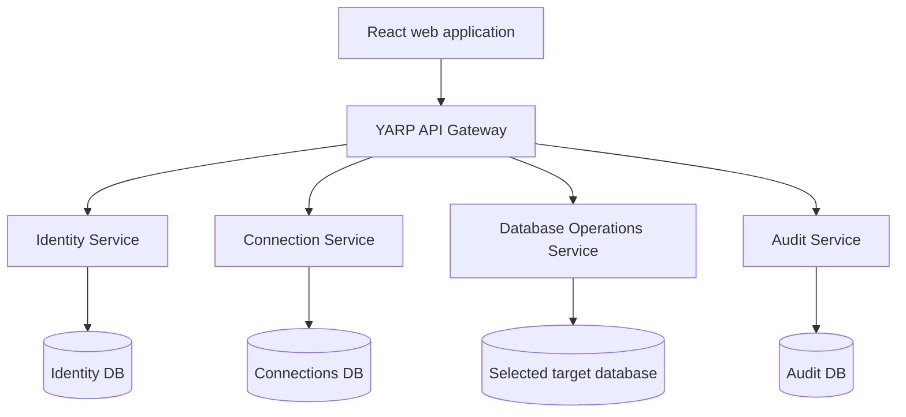
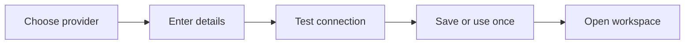
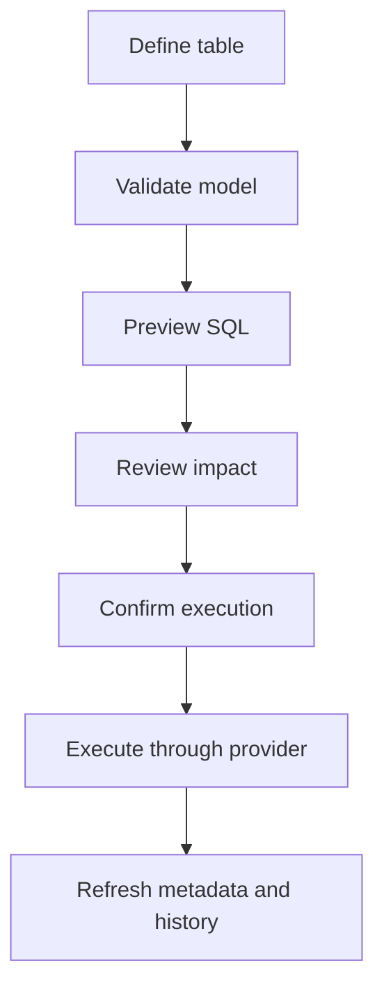

# SQL Automation Next — Complete Project Plan

> Working title: **SQL Automation Next**<br>
> Product type: Multi-database visual management, schema design, query, and learning platform<br>
> Frontend: React + TypeScript<br>
> Backend: ASP.NET Core microservices<br>
> Gateway: YARP<br>
> Initial provider: SQL Server<br>
> Planned providers: PostgreSQL and MySQL

---

## 1. Executive Summary

SQL Automation Next modernizes the original Java Swing college project into a professional web application. The product will let developers create secure database connections, explore schemas and data, design tables and relationships visually, execute SQL safely, inspect histories, and manage multiple database engines from one consistent interface.

The product is not intended to copy every feature from SSMS, pgAdmin, or DBeaver. Its strongest identity is:

> A clean visual database workspace that combines schema design, safe SQL execution, database history, and developer learning in one application.

The architecture will support multiple database providers, but development will be incremental. SQL Server will be implemented completely first. PostgreSQL and MySQL will be added through provider-specific adapters after the shared contracts and user experience are stable.

Microservices and an API Gateway will be used where they provide clear boundaries: identity, saved connections, database operations, and audit history. A message broker, advanced monitoring, and AI assistance will be introduced only after the core product is stable.

---

## 2. Product Vision

### Vision statement

Give developers a safe, visual, and understandable way to work with different relational databases without switching between several disconnected tools.

### Product goals

- Support SQL Server, PostgreSQL, and MySQL through a provider-based architecture.
- Make schema design understandable through forms, diagrams, previews, and generated SQL.
- Make database exploration fast through search, filtering, tabs, shortcuts, and contextual actions.
- Prevent accidental destructive operations with previews, warnings, permissions, and audit history.
- Help users learn SQL by explaining generated operations and showing the SQL behind visual actions.
- Provide a polished portfolio project demonstrating React, TypeScript, .NET, microservices, API Gateway, security, Docker, testing, and observability.

### Non-goals for the first release

- Replacing enterprise tools such as SSMS or DBeaver.
- Supporting every database engine or every vendor-specific feature.
- Automatically changing production databases without explicit review.
- Providing full database administration such as server provisioning, replication, backup scheduling, or cluster management.
- Allowing unrestricted public access to private database servers.
- Building an AI assistant before the normal workflows are reliable.

---

## 3. Legacy Project Modernization

The legacy Swing application already contains the product seed:

- Registration and login
- Create, view, update, truncate, and drop tables
- Add and modify columns
- Create relationships
- View table records
- Execute SQL

The new platform will preserve those ideas while replacing the legacy limitations:

| Legacy approach | Modern approach |
|---|---|
| One large Java source file | Feature-based React app and bounded .NET services |
| Swing desktop screens | Responsive browser UI |
| UI directly executes JDBC | React calls protected APIs through a gateway |
| PostgreSQL-only logic | Provider adapters for SQL Server, PostgreSQL, and MySQL |
| Plain-text credentials | Encrypted connection secrets and masked APIs |
| Dynamic concatenated SQL | Identifier validation, provider quoting, parameterization, and operation models |
| Minimal confirmation | Impact preview and typed confirmation for risky actions |
| No useful history | Query, schema-change, connection, and audit histories |
| Silent exceptions | Structured errors, correlation IDs, logs, and health monitoring |

---

## 4. Target Users and Roles

### User personas

#### Learner

- Wants to understand tables, keys, joins, and SQL.
- Uses visual designers and generated SQL previews.
- Benefits from explanations and safe execution rules.

#### Application developer

- Connects to local or development databases.
- Explores data and schemas.
- Runs queries, generates test data, and modifies structures.

#### Team developer

- Shares saved query templates and database documentation.
- Reviews schema changes and audit events.
- Needs permission-based access.

#### Administrator

- Manages application users and roles.
- Controls allowed operations and connection policies.
- Reviews audit logs, health, and security events.

### Application roles

| Role | Typical permissions |
|---|---|
| Viewer | Browse metadata, view records, run approved read-only queries |
| Developer | Viewer permissions plus create and modify schema/data |
| Database Manager | Developer permissions plus destructive operations and connection management |
| Administrator | User, role, security policy, audit, and system configuration |

Permissions should be capability-based internally, rather than relying only on broad role names.

---

## 5. Product Pillars

### 5.1 Connect

Create, test, save, organize, and securely use database connections.

### 5.2 Explore

Browse databases, schemas, tables, views, columns, relationships, indexes, and records.

### 5.3 Design

Create and modify database structures using visual tools with SQL previews.

### 5.4 Query

Write, format, execute, cancel, save, and analyze SQL in a professional workspace.

### 5.5 Protect

Prevent accidental damage through permissions, limits, previews, confirmations, and audit trails.

### 5.6 Understand

Show the SQL behind visual actions and explain provider-specific differences.

---

## 6. Scope and Release Strategy

### Release 1 — SQL Server vertical slice

- Registration, login, refresh tokens, logout, and roles
- React application shell and protected routes
- Create, test, edit, and delete SQL Server connections
- Dashboard with connection overview
- Browse schemas, tables, views, columns, keys, and indexes
- Paginated table data explorer
- Read-only SQL workspace
- Query results, duration, affected rows, errors, and cancellation
- Query history and saved queries
- Central audit logging

### Release 2 — Visual database operations

- Visual create-table designer
- Add, rename, alter, and remove columns
- Primary, unique, foreign-key, and check constraints
- Relationship wizard
- Interactive ER diagram
- Editable data grid
- Safe truncate and drop workflows
- Schema-change history with generated SQL
- CSV import and CSV/JSON export

### Release 3 — Multi-database support

- PostgreSQL provider
- MySQL provider
- Provider capability discovery
- Provider-specific type mapping
- Provider-aware SQL templates and UI controls
- Cross-provider connection dashboard

### Release 4 — Advanced developer tooling

- Schema comparison
- Migration script generation
- Test-data generator
- Database health checks
- Index recommendations
- Query execution plans where supported
- Shared query collections
- Notifications and background jobs

### Release 5 — Intelligent assistance

- Explain SQL and database errors
- Natural-language-to-SQL draft generation
- Schema suggestions from requirements
- Query optimization suggestions
- AI-generated operations always require preview and confirmation

---

## 7. High-Level Architecture



### Request flow

1. React authenticates through the gateway.
2. The gateway validates routing-level requirements and forwards the request.
3. The service performs its own authorization and validation.
4. Database Operations requests a short-lived connection secret from Connection Service when required.
5. The correct database provider performs the operation.
6. Important events are recorded in Audit Service.
7. React receives a consistent response envelope and correlation ID.

### Local-first deployment decision

The initial product should run locally through Docker Compose or local processes. This allows the .NET backend to reach SQL Server, PostgreSQL, or MySQL instances on the developer's machine or network.

A cloud-hosted backend usually cannot reach `localhost` on a user's laptop. If remote hosting is introduced later, use one of these models:

- Users connect only to publicly/network-accessible databases.
- A secure local connector agent creates an outbound tunnel.
- A desktop packaging option runs the backend locally.

The first release will not attempt to solve secure remote tunnelling.

---

## 8. Service Responsibilities

### 8.1 API Gateway

Recommended technology: ASP.NET Core with YARP.

Responsibilities:

- Expose one entry point to React.
- Route requests to the correct service.
- Apply CORS, rate limiting, and request-size limits.
- Validate access-token presence and basic claims.
- Forward correlation and trace identifiers.
- Provide a consolidated development entry point for API documentation.

The gateway must not contain database business logic.

Suggested routes:

```text
/api/auth/*             → Identity Service
/api/users/*            → Identity Service
/api/connections/*      → Connection Service
/api/workspaces/*       → Database Operations Service
/api/queries/*          → Database Operations Service
/api/schema/*           → Database Operations Service
/api/audit/*            → Audit Service
```

### 8.2 Identity Service

Responsibilities:

- Registration and login
- Password hashing through ASP.NET Core Identity
- Access and refresh tokens
- Refresh-token rotation and revocation
- Roles, permissions, and user status
- Password reset and email verification later
- Security events such as failed logins

Owned data:

- Users
- Roles
- Permissions
- User roles and claims
- Refresh tokens
- Login/security events

### 8.3 Connection Service

Responsibilities:

- Create, test, edit, duplicate, archive, and delete connection profiles.
- Encrypt and decrypt saved secrets.
- Support saved and session-only connections.
- Track favourite and recently used connections.
- Return masked connection details to clients.
- Enforce ownership and sharing policies.
- Return provider capabilities.

Owned data:

- Connection profiles
- Encrypted credentials
- Connection tags/folders
- Connection access grants
- Connection test summaries

### 8.4 Database Operations Service

Responsibilities:

- Discover database metadata.
- Browse schemas, tables, views, columns, keys, and indexes.
- Read and modify records.
- Create and alter database objects.
- Execute, cancel, and limit queries.
- Generate SQL previews.
- Import and export data.
- Compare schemas and generate migration drafts later.
- Select the correct provider adapter.

This service does not permanently store user database passwords.

### 8.5 Audit Service

Responsibilities:

- Record important application and database-operation events.
- Provide searchable audit history.
- Store operation status, actor, connection, object, duration, and correlation ID.
- Support retention and export policies.
- Consume asynchronous events when the message broker is introduced.

Audit events are append-only through normal application APIs.

### 8.6 Optional future services

- Notification Service for completion and failure notifications
- Background Job Service for large imports, exports, comparisons, and generation
- AI Assistance Service for governed model interactions

Do not create these until their workloads require independent scaling or isolation.

---

## 9. Multi-Database Provider Architecture

### Provider contract

The Database Operations Service will depend on an abstraction rather than a specific driver.

```csharp
public interface IDatabaseProvider
{
    DatabaseProviderType ProviderType { get; }
    ProviderCapabilities Capabilities { get; }

    Task<ConnectionTestResult> TestConnectionAsync(...);
    Task<IReadOnlyList<SchemaSummary>> GetSchemasAsync(...);
    Task<IReadOnlyList<DatabaseObjectSummary>> GetObjectsAsync(...);
    Task<TableDetails> GetTableDetailsAsync(...);
    Task<PagedResult<DynamicRow>> GetTableDataAsync(...);
    Task<SqlPreview> PreviewOperationAsync(...);
    Task<OperationResult> ExecuteOperationAsync(...);
    Task<QueryExecutionResult> ExecuteQueryAsync(...);
}
```

Provider implementations:

```text
IDatabaseProvider
├── SqlServerDatabaseProvider
├── PostgreSqlDatabaseProvider
└── MySqlDatabaseProvider
```

### Provider responsibilities

Each provider owns:

- Driver and connection-string creation
- Identifier validation and quoting
- Metadata queries
- Data-type mapping
- Pagination syntax
- DDL generation
- Supported feature declarations
- Error normalization
- Query cancellation behavior

### Capability-driven UI

The backend returns a capability document when a connection is opened:

```json
{
  "provider": "SqlServer",
  "supportsSchemas": true,
  "supportsMaterializedViews": false,
  "supportsExecutionPlans": true,
  "supportsTransactionalDdl": true,
  "supportsIdentityColumns": true
}
```

React uses capabilities to show, hide, or explain unavailable actions. The UI must not assume that all database engines behave identically.

### Provider rollout order

1. SQL Server: complete implementation and stable contracts.
2. PostgreSQL: validate abstractions against meaningful syntax differences.
3. MySQL: complete the initial relational provider set.

---

## 10. Frontend Technology Plan

### Core stack

- React with TypeScript and TSX
- Vite for development and builds
- React Router for route composition and protected routes
- TanStack Query for server state, caching, invalidation, and mutations
- React Hook Form with schema-based validation
- SCSS Modules for maintainable component styling
- Monaco Editor for the SQL workspace
- React Flow for ER diagrams and visual relationship editing
- TanStack Table or AG Grid Community for rich data tables
- A chart library for dashboard summaries
- Accessible headless UI primitives for dialogs, menus, tooltips, and comboboxes

### State strategy

| State type | Preferred approach |
|---|---|
| API/server data | TanStack Query |
| Form state | React Hook Form |
| Small component state | `useState` or `useReducer` |
| Authentication/session | Auth context plus query cache |
| Workspace tabs/layout | Small dedicated client store only if complexity requires it |
| URL-shareable filters | Search parameters |

Avoid placing all state in one global store.

### Angular-to-React mapping

| React choice | Familiar Angular concept |
|---|---|
| TanStack Query hook | API service plus RxJS/Signals state |
| React Hook Form | Reactive Forms |
| Context provider | Root-provided service for a narrow concern |
| Route layout | Router outlet with layout component |
| Custom hook | Reusable component/service logic |
| Error boundary | Application-level error component/handler |

---

## 11. Rich UI Direction

### Visual personality

The interface should feel like a focused developer tool rather than a generic admin dashboard.

- Dark mode as a first-class experience, with light mode available.
- Neutral slate surfaces with one strong accent colour.
- Database-provider colours used sparingly as identifiers.
- Dense but readable data layouts.
- Monospace font for identifiers, SQL, data types, and values.
- Clear separation between navigation, workspace, and details.
- Subtle motion for panels, tabs, progress, and status transitions.
- Accessible contrast, focus rings, labels, and keyboard navigation.

### Application shell

```text
┌─────────────────────────────────────────────────────────────┐
│ Top bar: Workspace | Search | Command Palette | User       │
├──────────────┬──────────────────────────────────────────────┤
│ Connection & │ Workspace tabs                              │
│ object tree  ├──────────────────────────────────────────────┤
│              │ Main content                                │
│              │                                              │
│              ├──────────────────────┬───────────────────────┤
│              │ Results / activity   │ Inspector / details   │
├──────────────┴──────────────────────┴───────────────────────┤
│ Status: provider | database | role | latency | environment │
└─────────────────────────────────────────────────────────────┘
```

### Rich interaction patterns

- Resizable left navigation and bottom result panels
- Collapsible right inspector
- Multiple workspace tabs with unsaved-change indicators
- Breadcrumbs for server, database, schema, and object
- Right-click/context menus on database objects
- Global command palette
- Keyboard shortcuts for common actions
- Drag-and-drop table placement in ER diagrams
- SQL preview drawer before schema changes
- Toast notifications plus a persistent activity centre
- Skeleton loading states instead of full-page spinners
- Helpful empty states with one primary action
- Status chips for connected, testing, read-only, failed, and expired
- Provider and environment badges to reduce wrong-database mistakes

### Safety-oriented colours

- Neutral: browse and read actions
- Blue/accent: create and primary actions
- Amber: potentially risky changes
- Red: destructive operations
- Green: successful validation or execution

Colour must never be the only indicator; use icons and text as well.

---

## 12. Information Architecture and Routes

```text
/
├── /login
├── /register
├── /connections
│   ├── /new
│   └── /:connectionId/edit
├── /workspace/:connectionId
│   ├── /overview
│   ├── /objects
│   ├── /table/:schema/:tableName
│   ├── /diagram
│   ├── /query
│   ├── /import
│   ├── /export
│   ├── /health
│   └── /history
├── /saved-queries
├── /activity
├── /audit
├── /settings
└── /admin
```

Workspace tabs may reflect routes so useful screens can be bookmarked and restored.

---

## 13. Complete Screen Plan

### 13.1 Welcome / Login

Purpose: secure entry with a confident first impression.

UI:

- Brand and short product message
- Email/username and password
- Show/hide password
- Remember this device where appropriate
- Forgot-password link for later
- Clear inline validation
- Loading and authentication error states
- Optional product visual showing schema, SQL, and history features

### 13.2 Registration

- Name, email, password, and confirmation
- Password-strength guidance
- Terms/security acknowledgement if deployed publicly
- Email verification later
- Direct transition to connection onboarding

### 13.3 First-run Onboarding

Three lightweight steps:

1. Choose database provider.
2. Create and test the first connection.
3. Open the guided workspace tour.

Users can skip the tour without blocking real work.

### 13.4 Connections Hub

Purpose: central landing page for all database connections.

Sections:

- Recent connections
- Favourites
- All connections
- Provider summary
- Folders/tags later

Connection card content:

- Friendly name
- Provider icon and database type
- Server and database name
- Environment badge: Local, Development, Test, Staging, Production
- Last connected time
- Current availability status
- User permission level
- Quick Connect button
- More menu: test, edit, duplicate, archive, delete

Views:

- Card view for discovery
- Compact table view for many connections

### 13.5 New Connection Wizard

Steps:

1. Select provider.
2. Enter server and authentication details.
3. Configure advanced SSL, timeout, and read-only options.
4. Test connection.
5. Name, classify, and save or use for this session only.

Fields vary by provider. Passwords are masked and never returned after saving.

Key UX:

- Provider-specific default ports
- Inline help for Windows, username/password, and integrated authentication
- Test result with latency and normalized error message
- “Save without password” and “Session only” options
- Production environment requires an extra acknowledgement

### 13.6 Workspace Overview Dashboard

Purpose: summarize the selected database before operations begin.

Cards:

- Tables
- Views
- Relationships
- Estimated database size
- Recent queries
- Recent schema changes
- Failed operations
- Connection latency

Widgets:

- Object distribution chart
- Largest tables
- Recently modified objects
- Quick actions
- Database health findings
- Active environment and permissions banner

The first release can use only metadata that is inexpensive and reliable.

### 13.7 Object Explorer

Tree hierarchy:

```text
Connection
└── Database
    └── Schema
        ├── Tables
        ├── Views
        ├── Procedures
        ├── Functions
        └── Sequences
```

Features:

- Lazy loading
- Search/filter objects
- Refresh selected node
- Pin/favourite objects
- Context actions
- Provider-aware object types
- Object count badges
- Permission-denied states without breaking the complete tree

### 13.8 Table Details

Header:

- Fully qualified table name
- Provider/database/schema context
- Row-count estimate
- Favourite and refresh controls
- Primary actions: Open Data, Edit Structure, Generate Script

Tabs:

#### Data

- Server-side pagination
- Sort and filter
- Global search only when safely implementable
- Column visibility and resizing
- Null and binary value presentation
- Add/edit/delete rows based on permissions
- Copy cell, row, or generated INSERT statement
- Export selected rows

#### Structure

- Columns, types, size/precision, nullable, default, identity
- Primary and unique constraints
- Inline link to edit through the designer

#### Relationships

- Incoming and outgoing foreign keys
- Referenced table and column
- Update/delete rules
- Visual mini-diagram

#### Indexes

- Index name, type, uniqueness, columns, and included columns
- Create index later

#### Triggers and advanced objects

- Display only when supported by the provider

#### History

- Schema changes affecting this table
- Record edits performed through the application where captured
- Filter by user, operation, status, and date

### 13.9 Visual Table Designer

Purpose: create or alter tables without hiding the generated SQL.

Layout:

- Table information header
- Column grid
- Constraint panels
- Generated SQL preview drawer
- Validation and impact panel

Column properties:

- Name
- Provider-specific data type
- Length, precision, and scale
- Nullable
- Primary key
- Identity/auto-increment
- Unique
- Default value
- Computed/generated configuration where supported
- Description/comment where supported

UX details:

- Add, duplicate, remove, and reorder columns
- Real-time identifier validation
- Warnings for risky conversions
- Unsaved-change guard
- Preview SQL before execution
- Save as draft script
- Execute only after authorization and confirmation

### 13.10 Relationship Designer

Modes:

- Guided relationship wizard
- Direct creation from the ER diagram

Wizard steps:

1. Select relationship type.
2. Select parent and child tables.
3. Map columns.
4. Configure update/delete behavior.
5. Review constraints and generated SQL.
6. Execute and view result.

One-to-one relationships require a unique constraint on the referencing key. Many-to-many creates or configures a junction table with explicit key choices.

### 13.11 ER Diagram Workspace

Features:

- Drag tables onto a canvas
- Auto-layout and manual layout
- Zoom, pan, minimap, fit-to-screen
- Expand/collapse columns
- Highlight primary and foreign keys
- Search and focus a table
- Trace incoming/outgoing relationships
- Create a relationship by connecting compatible columns
- Save personal layouts
- Export image/PDF later
- Open table details from the diagram

Large schemas should support partial diagrams rather than rendering every table automatically.

### 13.12 SQL Workspace

Layout:

- Query tabs
- Monaco editor
- Schema/object autocomplete
- Toolbar
- Results/messages/execution-plan panel
- Query metadata/status bar

Actions:

- Execute selection
- Execute complete script
- Stop/cancel
- Format SQL
- Save query
- Explain or estimate where supported
- Export results
- Open execution history

Result information:

- Columns and rows
- Affected-row count
- Duration
- Start/end time
- Truncation/row-limit warning
- Normalized database error with original provider details available
- Correlation ID for troubleshooting

Safety:

- Read-only mode
- Configurable row and execution-time limits
- Destructive statement detection
- Warnings for `UPDATE`/`DELETE` without `WHERE`
- Confirmation for destructive statements
- Production environment banner
- Never lowercase or rewrite user-entered query values

### 13.13 Saved Queries

- Personal query library
- Folders, tags, favourites, and search
- Query title and description
- Provider compatibility indicator
- Open in selected connection
- Duplicate and version later
- Shared team collections later

### 13.14 Unified History Centre

History is split into clear views:

#### Query history

- Exact executed SQL
- Connection and database
- User
- Status
- Duration and affected rows
- Timestamp
- Reopen in editor
- Save as reusable query

#### Schema-change history

- Operation model and generated SQL
- Object before/after summary
- User and connection
- Success/failure
- Impact preview
- Suggested reverse script when safe

#### Data-change history

- Row inserts, edits, and deletes performed through the application
- Sensitive values redacted according to policy
- Not a replacement for database-native auditing

#### Connection activity

- Connection tests
- Successful and failed opens
- Credential updates
- Permission failures

#### Security audit

- Login/logout
- Failed authentication
- Role and permission changes
- Connection sharing and deletion
- Administrative actions

Filters:

- History type
- Date range
- User
- Connection
- Provider
- Database object
- Operation
- Success/failure
- Correlation ID

### 13.15 Operation Details and Diff

Opened from any history item.

- Human-readable operation summary
- Generated/executed SQL
- Before and after schema representation
- Timeline of validation, execution, and audit recording
- Error details and correlation ID
- Reverse-operation guidance
- Copy/download script

“Undo” must not imply guaranteed restoration. The application may generate a reviewed reverse script only when the operation is safely reversible.

### 13.16 Import Wizard

Steps:

1. Select CSV or supported source.
2. Preview rows and detect headers.
3. Map source columns to target columns.
4. Validate types, nulls, and required fields.
5. Choose append, update, or create-table mode.
6. Review validation summary.
7. Run as a background job for large files.

Include downloadable error rows when an import partially fails.

### 13.17 Export Centre

- Export table, filtered result, or query result
- CSV and JSON initially
- SQL INSERT script later
- Column selection
- Null/date formatting options
- Progress and cancellation for large exports
- Export history

### 13.18 Test Data Generator

- Select target table
- Choose number of rows
- Infer generators from names and data types
- Customize generator per column
- Respect primary, unique, and foreign keys
- Preview sample rows
- Generate SQL or insert after confirmation

### 13.19 Schema Comparison

- Select source and target connection/database
- Compare schemas asynchronously
- Group added, removed, and changed objects
- Filter by object type
- Inspect side-by-side differences
- Generate synchronization draft
- Require manual review before execution

### 13.20 Database Health

Initial rule-based checks:

- Tables without primary keys
- Foreign keys without useful indexes
- Large tables
- Duplicate or suspicious indexes
- Naming inconsistencies
- Potentially unsafe nullable/default combinations
- Failed recent operations

Each finding includes severity, evidence, explanation, and suggested action.

### 13.21 Activity Centre

Persistent global panel for:

- Running queries
- Imports and exports
- Schema comparisons
- Connection tests
- Completed and failed background operations

Users can navigate away without losing progress visibility.

### 13.22 Settings

Sections:

- Profile
- Appearance and editor preferences
- Query defaults
- Safety defaults
- History retention
- Notifications
- Keyboard shortcuts
- Connection security

### 13.23 Administration

- Users and status
- Roles and permissions
- Allowed providers
- Connection policies
- Query limits
- Audit retention
- Service health summary
- Feature flags later

---

## 14. History and Audit Model

History is a core product feature and must be designed intentionally.

### Four different records

| Record | Purpose | User-facing? |
|---|---|---|
| Query execution | Reopen and understand executed SQL | Yes |
| Schema operation | Track visual and SQL-driven structural changes | Yes |
| Background job | Track long-running work and downloadable outputs | Yes |
| Security audit event | Compliance and administrative investigation | Restricted |

### Suggested schema-operation record

```text
OperationId
UserId
ConnectionId
Provider
DatabaseName
SchemaName
ObjectType
ObjectName
OperationType
OperationModelJson
GeneratedSql
ReverseSqlDraft
RiskLevel
Status
StartedAt
CompletedAt
DurationMs
ErrorCode
CorrelationId
```

### Retention

- Retention is configurable by history type.
- Secrets and connection strings are never recorded.
- Query parameters and data values may require redaction.
- Audit events are append-only through application workflows.
- High-volume result rows are not stored in query history by default.

---

## 15. Core User Workflows

### First connection



### Create a table safely



### Execute a query

1. Open or create a query tab.
2. Select connection, database, and schema context.
3. Write SQL with metadata autocomplete.
4. Execute the selection or script.
5. Safety analysis checks limits and risky statements.
6. User confirms when required.
7. Backend executes with cancellation and timeout support.
8. Results and messages appear in the bottom panel.
9. Execution is recorded in query and audit history.

### Investigate a change

1. Open History Centre.
2. Filter by table, user, or date.
3. Open the operation detail.
4. Review generated SQL, status, and before/after summary.
5. Copy a reverse script draft if the operation supports it.
6. Review and execute it as a new operation rather than silently undoing history.

---

## 16. API Design Outline

### Authentication

```text
POST   /api/auth/register
POST   /api/auth/login
POST   /api/auth/refresh
POST   /api/auth/logout
GET    /api/auth/me
```

### Connections

```text
GET    /api/connections
POST   /api/connections
POST   /api/connections/test
GET    /api/connections/{id}
PUT    /api/connections/{id}
POST   /api/connections/{id}/test
POST   /api/connections/{id}/duplicate
DELETE /api/connections/{id}
GET    /api/connections/{id}/capabilities
```

### Metadata and data

```text
GET    /api/workspaces/{connectionId}/schemas
GET    /api/workspaces/{connectionId}/objects
GET    /api/workspaces/{connectionId}/tables/{schema}/{table}
GET    /api/workspaces/{connectionId}/tables/{schema}/{table}/data
POST   /api/workspaces/{connectionId}/tables/{schema}/{table}/rows
PUT    /api/workspaces/{connectionId}/tables/{schema}/{table}/rows/{key}
DELETE /api/workspaces/{connectionId}/tables/{schema}/{table}/rows/{key}
```

### Schema operations

```text
POST   /api/schema/{connectionId}/operations/preview
POST   /api/schema/{connectionId}/operations/execute
GET    /api/schema/{connectionId}/operations/{operationId}
POST   /api/schema/{connectionId}/diagram
```

Use structured operation requests such as `CreateTableOperation`; do not let the visual designer send arbitrary concatenated SQL as its primary contract.

### Queries

```text
POST   /api/queries/{connectionId}/execute
POST   /api/queries/{executionId}/cancel
GET    /api/queries/history
GET    /api/queries/history/{executionId}
GET    /api/queries/saved
POST   /api/queries/saved
PUT    /api/queries/saved/{id}
DELETE /api/queries/saved/{id}
```

### Audit and activity

```text
GET    /api/audit/events
GET    /api/audit/events/{id}
GET    /api/activity
GET    /api/activity/{jobId}
POST   /api/activity/{jobId}/cancel
```

### Response standards

- Consistent problem-details errors
- Correlation ID on every request
- UTC timestamps
- Pagination metadata
- Provider error code plus safe normalized message
- No credentials or connection strings in responses

---

## 17. Data Ownership

### Identity DB

- Users
- Roles
- Permissions
- Role permissions
- User roles
- Refresh tokens
- Security events

### Connections DB

- Connection profiles
- Encrypted secret payloads
- Provider configuration
- Tags/folders
- User access grants
- Recent/favourite state

### Database Operations persistence

- Saved queries
- Query executions
- Schema operations
- Diagram layouts
- Import/export/background jobs

This can begin as a dedicated Operations DB. It should not be confused with the user-selected target database.

### Audit DB

- Append-only audit events
- Correlation and trace references
- Retention metadata

Each service accesses only the data it owns.

---

## 18. Security Plan

### Authentication and authorization

- ASP.NET Core Identity for users and password hashing
- Short-lived JWT access tokens
- Rotating refresh tokens with revocation
- Authorization policies based on capabilities
- Service-level authorization, not gateway-only authorization
- Account lockout and login throttling

### Connection secrets

- Encrypt secrets at rest using protected keys.
- Never return an existing password to React.
- Mask password fields during edit.
- Support session-only credentials.
- Exclude secrets from logs, traces, audit records, and error responses.
- Plan for key rotation.

### Database execution

- Validate and provider-quote identifiers.
- Parameterize values.
- Use structured operation models for visual schema changes.
- Apply command timeout and row limits.
- Support cancellation.
- Apply separate permission policies for read, write, DDL, and destructive operations.
- Display the active environment prominently.
- Require stronger confirmation for production connections.

### Destructive-operation confirmation levels

| Risk | Example | Confirmation |
|---|---|---|
| Low | Read metadata | None |
| Medium | Insert/update row | Review and normal confirmation |
| High | Alter/drop column | SQL preview and explicit confirmation |
| Critical | Drop/truncate table in production | Typed object name and elevated permission |

### Browser and API security

- HTTPS outside local development
- Strict CORS configuration
- Rate limits
- Request size limits
- Secure headers
- Input validation at API boundaries
- Dependency and container scanning in CI

---

## 19. Reliability and Observability

### Logging

- Structured application logs
- Correlation ID across gateway and services
- No passwords, tokens, or full connection strings
- Provider and operation categories
- Configurable log levels

### Tracing and metrics

- OpenTelemetry-compatible traces
- Request duration and failure rates
- Database operation duration
- Query cancellation and timeout counts
- Connection test success rate
- Background job duration

### Health checks

- Liveness endpoint per service
- Readiness endpoint per service
- Owned database connectivity
- Message broker health after it is introduced
- Gateway route health summary for administrators

### Error handling

- Central exception middleware per service
- Safe user-facing messages
- Original provider details available only when appropriate
- Retry only transient and idempotent operations
- Never automatically retry destructive DDL

---

## 20. Event-Driven Expansion

Start with synchronous HTTP for the core workflow. Add a message broker when Audit Service and background processing are stable enough to benefit.

Potential events:

```text
ConnectionTested
QueryExecuted
SchemaOperationCompleted
ImportCompleted
ExportCompleted
UserRoleChanged
```

Event requirements:

- Versioned contracts
- Event ID and correlation ID
- Idempotent consumers
- Outbox pattern for important events
- No secrets or unnecessary SQL result data
- Dead-letter handling and monitoring

RabbitMQ is a suitable learning choice for the later phase.

---

## 21. Repository Structure

```text
sql-automation-next/
├── client/
│   └── src/
│       ├── app/
│       ├── components/
│       ├── features/
│       │   ├── auth/
│       │   ├── connections/
│       │   ├── dashboard/
│       │   ├── object-explorer/
│       │   ├── table-data/
│       │   ├── table-designer/
│       │   ├── relationships/
│       │   ├── diagram/
│       │   ├── query-workspace/
│       │   ├── history/
│       │   └── settings/
│       ├── hooks/
│       ├── lib/
│       ├── models/
│       ├── routes/
│       └── styles/
│
├── gateway/
│   └── SqlAutomation.Gateway/
│
├── services/
│   ├── Identity/
│   │   ├── Identity.Api/
│   │   ├── Identity.Application/
│   │   ├── Identity.Domain/
│   │   └── Identity.Infrastructure/
│   ├── Connections/
│   ├── DatabaseOperations/
│   │   └── Providers/
│   │       ├── SqlServer/
│   │       ├── PostgreSql/
│   │       └── MySql/
│   └── Audit/
│
├── building-blocks/
│   ├── Shared.Contracts/
│   ├── Shared.Observability/
│   └── Shared.Testing/
│
├── tests/
├── docs/
├── deploy/
└── docker-compose.yml
```

Shared projects must remain small. Do not share domain entities or service database models across boundaries.

---

## 22. Testing Strategy

### Frontend

- Unit tests for pure utilities and provider-capability logic
- Component tests for forms, designers, grids, dialogs, and permission states
- Mock Service Worker or equivalent for API-focused tests
- End-to-end tests for critical workflows
- Accessibility checks for major screens
- Visual regression tests later for the application shell and designers

### Backend

- Unit tests for validators, policies, SQL generators, and provider factories
- Integration tests against real provider containers where practical
- API tests for authentication, authorization, validation, and error contracts
- Contract tests for gateway routes and service APIs
- Security tests for identifier handling and secret redaction

### Provider contract suite

Every database provider should pass a shared behavioural test suite:

- Connect and report capabilities
- List schemas and objects
- Read table metadata
- Create and remove a test table
- Add supported constraints
- Page and sort records
- Execute and cancel queries
- Normalize expected errors

Provider-specific tests cover unique behaviour.

### End-to-end critical paths

1. Register → login → add SQL Server connection → open workspace.
2. Browse table → inspect structure → view paginated data.
3. Create table → preview SQL → execute → inspect history.
4. Run safe query → view results → reopen from history.
5. Attempt destructive action without permission → verify it is blocked and audited.

---

## 23. Local Development and Delivery

### Local prerequisites

- Current Node.js LTS
- .NET SDK matching the selected project target
- Docker Desktop or compatible container runtime
- SQL Server container/local instance initially
- PostgreSQL and MySQL containers when their providers are developed

### Docker Compose responsibilities

- API Gateway
- Identity Service
- Connection Service
- Database Operations Service
- Audit Service
- Application-owned databases
- RabbitMQ only after the event phase begins

The React app may initially run through Vite for fast development.

### CI pipeline

- Restore dependencies
- Lint and format checks
- TypeScript type check
- Frontend tests
- .NET build and tests
- Provider integration tests where available
- Container build
- Dependency/security scanning
- Publish artifacts only after all required checks pass

---

## 24. Implementation Roadmap

Each milestone should end with a demonstrable vertical result and a small Git commit sequence.

### Milestone 0 — Product foundation

- Finalize product name and repository
- Create solution structure
- Establish code conventions
- Add Docker Compose baseline
- Add basic CI
- Create architecture decision records

### Milestone 1 — Identity and application shell

- Identity Service
- Gateway routing
- Registration/login/refresh/logout
- Protected React routes
- Main application layout
- Role-policy foundation

**Demo:** User can register, log in, refresh the page, and access the protected shell.

### Milestone 2 — SQL Server connections

- Connection Service
- Encrypted secret storage
- SQL Server connection form
- Test, save, edit, duplicate, and delete
- Connections Hub

**Demo:** User creates and successfully tests a SQL Server connection.

### Milestone 3 — Metadata workspace

- Provider abstraction
- SQL Server provider
- Capability endpoint
- Object Explorer
- Workspace overview
- Table structure tabs

**Demo:** User connects and browses real SQL Server schemas and tables.

### Milestone 4 — Data explorer

- Server-side pagination
- Sorting and safe filters
- Dynamic result model
- Data grid states
- CSV/JSON export of limited results

**Demo:** User opens a table and explores records without loading everything.

### Milestone 5 — SQL workspace

- Monaco editor
- Query tabs
- Execute selection/script
- Row and timeout limits
- Cancellation
- Results and messages
- Query history and saved queries

**Demo:** User safely runs and reopens queries.

### Milestone 6 — Audit and activity

- Audit Service
- Correlation IDs
- Query, connection, and security events
- Unified History Centre
- Operation detail screen

**Demo:** User can trace connection and query activity end to end.

### Milestone 7 — Visual table designer

- Structured operation contracts
- Create-table designer
- SQL preview
- Validation and risk classification
- Schema-operation history

**Demo:** User visually creates a table and sees the exact SQL and history.

### Milestone 8 — Schema editing and relationships

- Add/alter/rename/drop column workflows
- Constraint management
- Relationship wizard
- Typed destructive confirmations
- Reverse-script drafts where safe

**Demo:** User safely evolves an existing schema.

### Milestone 9 — ER diagram

- React Flow canvas
- Table nodes and relationship edges
- Saved layouts
- Create relationship from canvas
- Large-schema partial loading

**Demo:** User designs and inspects relationships visually.

### Milestone 10 — Import, export, and jobs

- CSV import wizard
- Large export workflow
- Job persistence
- Activity Centre
- Cancellation and failure downloads

**Demo:** User imports validated data and tracks background progress.

### Milestone 11 — PostgreSQL provider

- Driver and connection settings
- Metadata and data browsing
- Query execution
- Supported schema operations
- Provider contract tests

**Demo:** The same UI works against SQL Server and PostgreSQL.

### Milestone 12 — MySQL provider

- Equivalent provider implementation
- Capability differences
- Provider contract tests
- Cross-provider polish

**Demo:** Three database engines work through one product experience.

### Milestone 13 — Advanced tools

- Test-data generator
- Schema comparison
- Health checks
- Migration draft generation
- Execution-plan integration where supported

### Milestone 14 — Intelligent assistance

- AI-specific service boundary
- SQL explanation
- Error explanation
- Draft query generation
- Guardrails, preview, and explicit execution approval

---

## 25. MVP Acceptance Criteria

The initial MVP is complete when:

- A user can register, log in, refresh a session, and log out.
- A user can create and test a SQL Server connection without exposing its password.
- A user sees only connections they own or can access.
- The workspace can list schemas, tables, columns, keys, and indexes.
- Table rows load through pagination rather than loading the full table.
- A user can execute a read-only query with timeout, row limit, and cancellation.
- Results display columns, rows, duration, and safe error information.
- Query and connection histories are searchable.
- Roles block unauthorized operations on both UI and API.
- Every important operation includes a correlation ID and audit record.
- Core workflows have automated integration and end-to-end tests.

---

## 26. Definition of Done for a Feature

A feature is done when:

- Requirements and permission rules are clear.
- Loading, empty, success, error, and permission-denied states are implemented.
- Mobile is usable for overview/history screens; desktop is optimized for designers and SQL work.
- Keyboard and accessibility behaviour is verified.
- API validation and authorization are present.
- Secrets and sensitive values are redacted.
- Audit/history behaviour is defined.
- Automated tests cover the critical behaviour.
- Documentation and API examples are updated.
- No unrelated existing functionality is removed.
- A reviewer can demonstrate the complete user flow.

---

## 27. Key Risks and Mitigations

| Risk | Mitigation |
|---|---|
| Too many microservices slow development | Keep four bounded services; delay optional services |
| Provider differences leak throughout UI | Capability contracts and provider-specific adapters |
| Credentials are exposed | Encrypted storage, masked APIs, redacted logs, session-only option |
| Dynamic SQL creates injection risk | Structured operations, identifier validation/quoting, parameterized values |
| Large tables freeze the application | Server pagination, limits, streaming/export jobs, cancellation |
| Users damage the wrong environment | Environment badges, production banners, permissions, typed confirmation |
| “Undo” creates false confidence | Use reviewed reverse-script drafts and honest reversibility labels |
| Browser-hosted app cannot reach local DB | Local-first deployment; design a connector agent only later |
| UI becomes crowded | Resizable panels, contextual actions, progressive disclosure, command palette |
| Shared code couples services | Share contracts/observability only, never service domain models |
| AI generates unsafe SQL | Draft-only generation, provider validation, preview, permission check, confirmation |

---

## 28. Product Backlog Beyond the Roadmap

- Multiple saved workspace layouts
- Shareable read-only schema diagrams
- SQL snippets and templates
- Query version history
- Team comments on schema changes
- Database object documentation
- Favourite tables and recent objects
- Keyboard-driven quick open
- Database-side permission viewer
- Stored procedure/function explorer
- Execution-plan visualization
- Configurable database health rules
- Read-only connection enforcement
- Connection folders and tags
- Secret manager integration
- Plugin/provider SDK for future engines
- Desktop/local connector agent

---

## 29. Recommended Branding Direction

Keep **SQL Automation Next** as the repository/project name initially. A shorter product name can be selected before public release.

Possible names:

- QueryForge
- SchemaPilot
- DataDock
- PolyDB Studio
- SchemaFlow

Suggested tagline:

> Connect, explore, design, and understand your databases.

The final name should be checked for existing products and trademark conflicts before public use.

---

## 30. Decisions to Lock Before Coding

Recommended defaults:

| Decision | Recommendation |
|---|---|
| Deployment | Local-first |
| First provider | SQL Server |
| Next providers | PostgreSQL, then MySQL |
| Backend style | Four bounded microservices plus gateway |
| Gateway | YARP |
| Application-owned databases | Separate logical databases per service |
| Frontend | React + TypeScript + Vite |
| Styling | SCSS Modules with reusable design tokens/primitives |
| Server state | TanStack Query |
| Forms | React Hook Form with schema validation |
| SQL editor | Monaco Editor |
| ER diagram | React Flow |
| Initial messaging | None; add RabbitMQ with audit/background events later |
| Authentication | ASP.NET Core Identity with JWT and refresh rotation |
| Initial SQL mode | Read-only first, then governed write/DDL operations |

### Open decisions

- Final product name
- Public single-user vs team-oriented first release
- TanStack Table vs AG Grid Community for dynamic table data
- Exact application-owned database split for Operations and Audit
- Whether Windows Authentication must work inside Docker in the first release
- Whether SQL Server Express or a container is the default tutorial setup

---

## 31. Recommended Starting Point

The first implementation should be a vertical slice:

> Register → Login → Add SQL Server Connection → Test → Open Workspace → Browse Tables → Open Table → View Structure and Paginated Data

This validates React, authentication, gateway routing, service boundaries, secret handling, provider abstraction, and SQL Server connectivity before adding risky schema operations.

The next slice should be:

> Open SQL Workspace → Execute Read-only Query → Cancel/Limit → View Results → Reopen from History

Only after these flows are reliable should the product add create, alter, truncate, drop, relationship design, imports, and multi-provider implementations.

---

## 32. Project Success Criteria

The project succeeds when it demonstrates more than a visually improved database UI. It should prove that:

- One consistent product can handle meaningful differences between database engines.
- Visual operations are transparent because users can inspect generated SQL.
- Safety and history are built into workflows rather than added afterward.
- React screens remain feature-based and production-readable.
- .NET services have clear ownership and do not share one uncontrolled database layer.
- The platform is observable, testable, and runnable by another developer from documentation.
- New providers and advanced features can be added without rewriting the core experience.

---

**Document status:** Initial complete product and engineering plan<br>
**Recommended immediate next task:** Create the repository foundation and implement Milestone 0 only.
